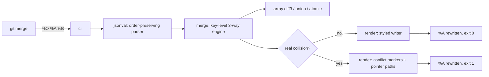

# keymerge

[English](README.md) | [中文](README.zh.md) | [日本語](README.ja.md)

[](LICENSE) [](go.mod) [](CHANGELOG.md)  [](CONTRIBUTING.md)

**keymerge：JSON 専用のオープンソース git merge driver —— キー単位の三方向マージで、本物の衝突だけをコンフリクトにする。`.gitattributes` 一行で有効化。**


```bash
git clone https://github.com/JaydenCJ/keymerge && cd keymerge
go build -o keymerge ./cmd/keymerge    # single static binary, stdlib only
```

> プレリリース：v0.1.0 はまだどのパッケージレジストリにも公開されていません。上記の通りソースからビルドしてください（Go ≥1.22 で可）。

## なぜ keymerge？

`package.json` や `tsconfig.json`、ロケールファイルを持つチームなら誰でもあの儀式を知っています。二つのブランチが*別々の*キーを触ったのに、git の行ベースマージは行の重なりを検出し、誰かが存在しなかったはずのコンフリクトを手で解消する——。`jd` や `json-diff` のような diff ツールは意味的な差分を美しく見せてくれますが、マージの外側にいるため、結局手作業です。`npm-merge-driver` はパッケージマネージャを再実行する方式で、直せるのは一種類のファイルだけ。keymerge は git がまさにこの用途のために設計した場所 —— merge driver —— に接続します。base・ours・theirs を解析してキー単位でマージし（片側だけの変更は採用、同一の変更は収束、削除は伝播、配列は本物の diff3）、あなたのインデントとキー順のままファイルを書き戻します。本当の衝突 —— 双方が同じキーを異なる値に変えた場合 —— だけがコンフリクトマーカーになり、衝突したメンバーの真上に置かれ、stderr には RFC 6901 ポインタが出ます。導入は `keymerge install --pattern '*.json'` だけ。以後 `git merge`・rebase・cherry-pick が偽のコンフリクトであなたを煩わせることはありません。

| | keymerge | git テキストマージ | jd / json-diff | npm-merge-driver |
|---|---|---|---|---|
| 行ではなくキーでマージ | ✅ | ❌ | 対象外（diff のみ） | 対象外（再インストール） |
| `git merge` / rebase / cherry-pick の内部で動作 | ✅ | ✅ | ❌ ビューア | ✅ |
| 任意の JSON ファイルに対応 | ✅ | ✅ | ✅ | ❌ lockfile のみ |
| キー並べ替え / `1` vs `1.0` は衝突しない | ✅ | ❌ | ✅ diff 上のみ | ❌ |
| キー順・インデント・数値リテラルを保持 | ✅ | ✅（テキスト面） | 対象外 | ❌ 全体を再生成 |
| エディタが理解するコンフリクトマーカー | ✅ キー単位 | ✅ 行単位 | ❌ | 対象外 |
| 配列戦略（diff3 / atomic / union） | ✅ | ❌ | ❌ | ❌ |
| ランタイム依存 | 0 | 0（組み込み） | Go バイナリ / npm パッケージ | node + npm |

<sub>2026-07-12 時点で確認：keymerge は Go 標準ライブラリのみを import。npm-merge-driver は `npm install` の再実行で lockfile の衝突を解決するため、Node ツールチェーンが必要でファイルを丸ごと書き換えます。</sub>

## 特徴

- **キー単位の三方向マージ** —— 別々のキーへの変更は、行がどれほど近くても衝突しない。同一の変更は収束し、削除は rebase の連鎖でも正しく伝播。
- **本物の衝突だけをコンフリクトに** —— edit/edit、add/add、delete/edit、型の衝突を RFC 6901 ポインタ（`/dependencies/react`）付きで報告し、衝突メンバーの真上に git 形式のマーカーを描画。
- **テキストではなく意味で比較** —— オブジェクトのキー順は無視（並べ替えは変更ではない）、数値は値で比較（`1` == `1.0` == `1e0`）、キー削除と `null` 設定は厳密に区別。
- **配列は diff3 でマージ** —— base に対する LCS 整列で重ならない編集をマージ。双方が編集した単一要素は再帰するため、オブジェクト配列はフィールド単位でマージ。`--arrays union|atomic` が順序不問リストと一括ファイルをカバー。
- **フォーマットはそのまま生き残る** —— インデント単位（2/4 スペース、タブ）、LF/CRLF、末尾改行、生の数値リテラル（`1.50e3`、20 桁の id）をすべて保持。キー順は ours に従い、theirs の追加キーは文脈に沿って挿入。
- **ワンコマンド導入、失敗しても安全** —— `keymerge install --pattern '*.json'` が git config と `.gitattributes` を冪等に書き込む。不正な JSON は行・列番号付きで中断してファイルには触れず、通常の git コンフリクトにフォールバック。
- **依存ゼロ・完全オフライン** —— Go 標準ライブラリのみ。テレメトリもネットワークも一切なし。

## クイックスタート

```bash
# in your repository: register the driver and route *.json to it
keymerge install --pattern '*.json'
git merge feature    # that's it — keymerge now handles JSON merges
```

または三つのファイルを直接マージ（fixture はリポジトリに同梱。以下は実際にキャプチャした出力）：

```bash
keymerge merge examples/package-json/base.json examples/package-json/ours.json examples/package-json/theirs.json -o -
```

```text
{
  "name": "shop-api",
  "version": "1.4.0",
  "scripts": {
    "build": "tsc -p .",
    "lint": "eslint .",
    "test": "node --test"
  },
  "dependencies": {
    "express": "^4.19.0",
    "pino": "^9.0.0",
    "zod": "^3.24.1"
  },
  "keywords": [
    "api",
    "http",
    "shop"
  ]
}
```

終了コード 0：ours の `zod` 更新と `lint` スクリプトが theirs の `pino` とキーワードとマージされました —— 行ベースなら確実にコンフリクトするケースです。双方が本当に衝突した場合（`keymerge check`、実際の出力）：

```text
/version                                 edit/edit
/scripts/start                           edit/edit
keymerge: 2 conflicts in examples/conflict/ours.json
```

## マージ規則

完全な決定マトリクス・セマンティクス・エッジケースは [docs/merge-rules.md](docs/merge-rules.md) を参照。

| 状況（base 比較） | 結果 |
|---|---|
| 片側だけがキーを変更 | その変更を採用 |
| 双方がまったく同じ変更 | 収束、コンフリクトなし |
| 双方が同じキーを異なる値に変更 | そのキーで `edit/edit` コンフリクト |
| 片側が削除、もう片側が編集 | `delete/edit` コンフリクト |
| 双方が同じキーに異なるオブジェクトを追加 | 再帰 —— 内部の衝突だけがコンフリクト |
| 双方が同じ配列を変更 | 要素単位の diff3。好みで `--arrays union` / `atomic` |

## CLI リファレンス

git が実行するのは `keymerge merge %O %A %B -p %P -m %L`（`install` が書き込む）。終了コード：0 クリーン、1 コンフリクト、2 用法エラー、3 ランタイムエラー。

| Key | Default | Effect |
|---|---|---|
| `merge <base> <ours> <theirs>` | — | 三方向マージ。`<ours>` を書き換える（git driver の契約） |
| `check <base> <ours> <theirs>` | — | ドライラン：衝突パスを列挙し、何も書かない |
| `install` | ローカルリポジトリ | `merge.keymerge.*` を git config に設定。`--global` で全リポジトリに |
| `--pattern <glob>`（install） | — | `<glob> merge=keymerge` を `.gitattributes` へ冪等に追記 |
| `--print`（install） | — | 実行される git コマンドを表示するだけで、何も変更しない |
| `-C <dir>`（install） | `.` | `<dir>` にあるリポジトリを対象にする |
| `-o, --output` | その場で上書き | 結果を指定ファイルへ。`-` で stdout |
| `-p, --path` | ours のファイル名 | メッセージ内の表示パス（git が `%P` を渡す） |
| `-m, --marker-size` | `7` | コンフリクトマーカー長（git が `%L` を渡す） |
| `--arrays` | `merge` | 配列戦略：`merge`、`atomic`、`union` |
| `--ours-label, --theirs-label` | `ours` / `theirs` | `<<<<<<<` / `>>>>>>>` の後ろのラベル |

## 検証

このリポジトリは CI を持ちません。上記の主張はすべてローカル実行で検証されます：

```bash
go test ./...            # 88 deterministic tests, offline, < 5 s
bash scripts/smoke.sh    # builds, then drives a real git merge through the driver; prints SMOKE OK
```

## アーキテクチャ



## ロードマップ

- [x] v0.1.0 —— キー単位三方向マージエンジン、diff3/union/atomic 配列、スタイル保持ライター、精密なコンフリクトマーカー、`merge`/`check`/`install` CLI、88 テスト + smoke スクリプト
- [ ] JSON5 / JSONC 入力（コメントと末尾カンマがマージ後も残る）
- [ ] `.gitattributes` でのパス別オプション（キーワードリストに `merge=keymerge -arrays=union` など）
- [ ] 同じマージエンジン上の YAML フロントエンド
- [ ] 残ったマーカーを対話的に解消する `keymerge mergetool` モード
- [ ] 繰り返される衝突のための構造的な `git rerere` 型記憶

完全なリストは [open issues](https://github.com/JaydenCJ/keymerge/issues) へ。

## コントリビュート

Issue・ディスカッション・PR を歓迎します —— ローカルワークフロー（フォーマット、vet、テスト、`SMOKE OK`）は [CONTRIBUTING.md](CONTRIBUTING.md) を参照。入門タスクは [good first issue](https://github.com/JaydenCJ/keymerge/issues?q=is%3Aissue+is%3Aopen+label%3A%22good+first+issue%22)、設計の議論は [Discussions](https://github.com/JaydenCJ/keymerge/discussions) で。

## ライセンス

[MIT](LICENSE)
