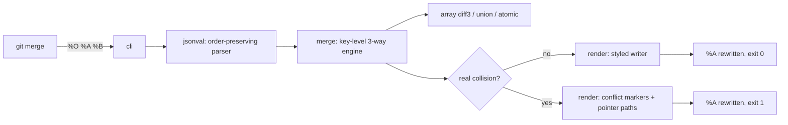

# keymerge

[English](README.md) | [中文](README.zh.md) | [日本語](README.ja.md)

[](LICENSE) [](go.mod) [](CHANGELOG.md)  [](CONTRIBUTING.md)

**keymerge：an open-source git merge driver for JSON — key-level three-way merge that conflicts only on real collisions, one `.gitattributes` line away.**


```bash
git clone https://github.com/JaydenCJ/keymerge && cd keymerge
go build -o keymerge ./cmd/keymerge    # single static binary, stdlib only
```

> Pre-release: v0.1.0 is not tagged on a package registry yet; build from source as above (any Go ≥1.22).

## Why keymerge?

Every team with a `package.json`, a `tsconfig.json` or a locale file knows the ritual: two branches touch *different* keys, git's line-based merge sees overlapping lines, and someone hand-resolves a conflict that never existed. Diff tools like `jd` and `json-diff` can show you the semantic difference beautifully — but they sit outside the merge; you still resolve by hand. `npm-merge-driver` fixes exactly one file family by re-running the package manager. keymerge instead plugs into the spot git designed for this: a merge driver. It parses base, ours and theirs, merges key-by-key (one-sided changes win, identical changes converge, deletions propagate, arrays get a real diff3), and rewrites the file in your indent style with your key order. Only a genuine collision — both sides changing the same key differently — produces conflict markers, placed exactly on the colliding member, with an RFC 6901 pointer path on stderr. Setup is `keymerge install --pattern '*.json'`, and from then on `git merge`, rebase and cherry-pick just stop bothering you about fake conflicts.

| | keymerge | git text merge | jd / json-diff | npm-merge-driver |
|---|---|---|---|---|
| Merges by key, not by line | ✅ | ❌ | n/a (diff only) | n/a (reinstalls) |
| Runs inside `git merge` / rebase / cherry-pick | ✅ | ✅ | ❌ viewer | ✅ |
| Works on any JSON file | ✅ | ✅ | ✅ | ❌ lockfiles only |
| Key reorder / `1` vs `1.0` never conflict | ✅ | ❌ | ✅ in diffs | ❌ |
| Preserves key order, indent, number literals | ✅ | ✅ (textual) | n/a | ❌ regenerates |
| Conflict markers your editor understands | ✅ per key | ✅ per line | ❌ | n/a |
| Array strategies (diff3 / atomic / union) | ✅ | ❌ | ❌ | ❌ |
| Runtime dependencies | 0 | 0 (built-in) | Go binary / npm pkgs | node + npm |

<sub>Checked 2026-07-12: keymerge imports the Go standard library only; npm-merge-driver resolves lockfile conflicts by re-running `npm install`, which requires a Node toolchain and rewrites the file wholesale.</sub>

## Features

- **Key-level three-way merge** — changes to different keys never conflict, no matter how close their lines are; identical changes converge; deletions propagate through rebase chains.
- **Conflicts only on real collisions** — edit/edit, add/add, delete/edit and type clashes, each reported with an RFC 6901 pointer (`/dependencies/react`) and rendered as git-style markers exactly on the colliding member.
- **Semantic, not textual** — object key order is ignored (reordering is not a change), numbers compare by value (`1` == `1.0` == `1e0`), and absent is distinct from `null`.
- **Arrays merged with diff3** — LCS alignment against the base merges non-overlapping edits; a both-edited element recurses so arrays of objects merge field-by-field; `--arrays union|atomic` cover order-insensitive lists and all-or-nothing files.
- **Your formatting survives** — indent unit (2/4 spaces, tabs), LF/CRLF, trailing newline and raw number literals (`1.50e3`, 20-digit ids) are preserved; key order follows ours with theirs' additions inserted in context.
- **One-command setup, fail-safe by design** — `keymerge install --pattern '*.json'` writes git config and `.gitattributes` idempotently; invalid JSON aborts with line/column and leaves your file untouched, falling back to a normal git conflict.
- **Zero dependencies, fully offline** — Go standard library only; no telemetry, no network, ever.

## Quickstart

```bash
# in your repository: register the driver and route *.json to it
keymerge install --pattern '*.json'
git merge feature    # that's it — keymerge now handles JSON merges
```

Or merge three files directly (fixtures shipped in this repo; real captured output):

```bash
keymerge merge examples/package-json/base.json examples/package-json/ours.json examples/package-json/theirs.json -o -
```

```text
{
  "name": "shop-api",
  "version": "1.4.0",
  "scripts": {
    "build": "tsc -p .",
    "lint": "eslint .",
    "test": "node --test"
  },
  "dependencies": {
    "express": "^4.19.0",
    "pino": "^9.0.0",
    "zod": "^3.24.1"
  },
  "keywords": [
    "api",
    "http",
    "shop"
  ]
}
```

Exit 0: ours' `zod` bump and `lint` script merged with theirs' `pino` and keyword — a guaranteed conflict under line-based merging. When both sides really do collide (`keymerge check`, real output):

```text
/version                                 edit/edit
/scripts/start                           edit/edit
keymerge: 2 conflicts in examples/conflict/ours.json
```

## Merge rules

The full decision matrix, semantics and edge cases live in [docs/merge-rules.md](docs/merge-rules.md).

| Situation (vs base) | Result |
|---|---|
| Only one side changed a key | that change wins |
| Both sides made the identical change | converged, no conflict |
| Both sides changed the same key differently | conflict `edit/edit` at that key |
| One side deleted, the other edited | conflict `delete/edit` |
| Both added the same key with different objects | recurse — only inner collisions conflict |
| Both changed the same array | diff3 by element; `--arrays union` / `atomic` to taste |

## CLI reference

`keymerge merge %O %A %B -p %P -m %L` is what git runs (written by `install`). Exit codes: 0 clean, 1 conflicts, 2 usage error, 3 runtime error.

| Key | Default | Effect |
|---|---|---|
| `merge <base> <ours> <theirs>` | — | three-way merge; rewrites `<ours>` (git driver contract) |
| `check <base> <ours> <theirs>` | — | dry run: list collision paths, write nothing |
| `install` | local repo | set `merge.keymerge.*` git config; `--global` for all repos |
| `--pattern <glob>` (install) | — | also add `<glob> merge=keymerge` to `.gitattributes`, idempotently |
| `--print` (install) | — | print the git commands it would run, change nothing |
| `-C <dir>` (install) | `.` | operate on the repository at `<dir>` |
| `-o, --output` | in place | write result to a file, or `-` for stdout |
| `-p, --path` | ours filename | display path in messages (git passes `%P`) |
| `-m, --marker-size` | `7` | conflict marker length (git passes `%L`) |
| `--arrays` | `merge` | array strategy: `merge`, `atomic` or `union` |
| `--ours-label, --theirs-label` | `ours` / `theirs` | text after `<<<<<<<` / `>>>>>>>` |

## Verification

This repository ships no CI; every claim above is verified by local runs:

```bash
go test ./...            # 88 deterministic tests, offline, < 5 s
bash scripts/smoke.sh    # builds, then drives a real git merge through the driver; prints SMOKE OK
```

## Architecture



## Roadmap

- [x] v0.1.0 — key-level 3-way merge engine, diff3/union/atomic arrays, style-preserving writer, precise conflict markers, `merge`/`check`/`install` CLI, 88 tests + smoke script
- [ ] JSON5 / JSONC input (comments and trailing commas survive the merge)
- [ ] Per-path options in `.gitattributes` (e.g. `merge=keymerge -arrays=union` for keyword lists)
- [ ] YAML front-end on the same merge engine
- [ ] `keymerge mergetool` mode for resolving leftover markers interactively
- [ ] Structural `git rerere`-style memory for repeated collisions

See the [open issues](https://github.com/JaydenCJ/keymerge/issues) for the full list.

## Contributing

Issues, discussions and pull requests are welcome — see [CONTRIBUTING.md](CONTRIBUTING.md) for the local workflow (format, vet, tests, `SMOKE OK`). Good entry points are labelled [good first issue](https://github.com/JaydenCJ/keymerge/issues?q=is%3Aissue+is%3Aopen+label%3A%22good+first+issue%22), and design questions live in [Discussions](https://github.com/JaydenCJ/keymerge/discussions).

## License

[MIT](LICENSE)
