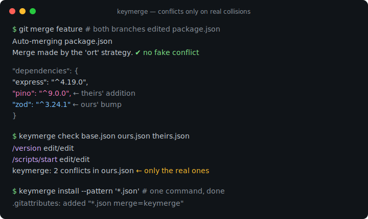
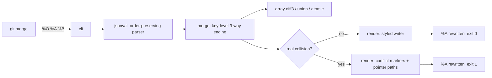

# keymerge

[English](README.md) | [中文](README.zh.md) | [日本語](README.ja.md)

[](LICENSE) [](go.mod) [](CHANGELOG.md)  [](CONTRIBUTING.md)

**keymerge：开源的 JSON 专用 git merge driver —— 键级三方合并，只在真正的冲突上报冲突，一行 `.gitattributes` 即可启用。**



```bash
git clone https://github.com/JaydenCJ/keymerge && cd keymerge
go build -o keymerge ./cmd/keymerge    # single static binary, stdlib only
```

> 预发布：v0.1.0 尚未发布到任何包仓库；请按上面的方式从源码构建（Go ≥1.22 均可）。

## 为什么选 keymerge？

每个维护 `package.json`、`tsconfig.json` 或语言包文件的团队都熟悉这套仪式：两个分支改了*不同*的键，git 的按行合并却看到重叠的行，于是有人手工解决了一个根本不存在的冲突。`jd`、`json-diff` 这类 diff 工具能把语义差异展示得很漂亮——但它们游离在合并流程之外，你依然要手工解决。`npm-merge-driver` 只修复一类文件，方式是重跑包管理器。keymerge 则接入 git 为此专门设计的位置：merge driver。它解析 base、ours、theirs 三方，逐键合并（单侧修改直接生效，相同修改自动收敛，删除正常传播，数组走真正的 diff3），再按你的缩进风格和键序把文件写回。只有真正的碰撞——双方把同一个键改成了不同的值——才会产生冲突标记，并且精确落在冲突成员上，stderr 里附 RFC 6901 指针路径。安装只需 `keymerge install --pattern '*.json'`，此后 `git merge`、rebase、cherry-pick 都不会再拿假冲突烦你。

| | keymerge | git 文本合并 | jd / json-diff | npm-merge-driver |
|---|---|---|---|---|
| 按键合并而非按行 | ✅ | ❌ | 不适用（只 diff） | 不适用（重装） |
| 运行于 `git merge` / rebase / cherry-pick 内部 | ✅ | ✅ | ❌ 查看器 | ✅ |
| 适用于任意 JSON 文件 | ✅ | ✅ | ✅ | ❌ 仅 lockfile |
| 键重排 / `1` vs `1.0` 永不冲突 | ✅ | ❌ | ✅ 仅限 diff | ❌ |
| 保留键序、缩进、数字字面量 | ✅ | ✅（文本层面） | 不适用 | ❌ 整体重新生成 |
| 编辑器认识的冲突标记 | ✅ 按键 | ✅ 按行 | ❌ | 不适用 |
| 数组策略（diff3 / atomic / union） | ✅ | ❌ | ❌ | ❌ |
| 运行时依赖 | 0 | 0（内置） | Go 二进制 / npm 包 | node + npm |

<sub>核对于 2026-07-12：keymerge 只导入 Go 标准库；npm-merge-driver 通过重跑 `npm install` 解决 lockfile 冲突，需要 Node 工具链且会整体重写文件。</sub>

## 特性

- **键级三方合并** —— 改动不同键的修改永不冲突，无论它们的行离得多近；相同修改自动收敛；删除在 rebase 链中正常传播。
- **只在真正的碰撞上报冲突** —— edit/edit、add/add、delete/edit 与类型冲突，每个都带 RFC 6901 指针（`/dependencies/react`）上报，并以 git 风格标记精确渲染在冲突成员上。
- **语义而非文本** —— 忽略对象键序（重排不算修改），数字按数值比较（`1` == `1.0` == `1e0`），缺失与 `null` 严格区分。
- **数组用 diff3 合并** —— 基于 LCS 对齐 base，互不重叠的编辑直接合并；双方都改的单个元素会递归下去，对象数组因此能逐字段合并；`--arrays union|atomic` 覆盖无序列表与整体文件两种场景。
- **你的格式原样保留** —— 缩进单位（2/4 空格、tab）、LF/CRLF、末尾换行、原始数字字面量（`1.50e3`、20 位 id）全部保留；键序跟随 ours，theirs 的新增键按上下文插入。
- **一条命令装好，失败也安全** —— `keymerge install --pattern '*.json'` 幂等地写入 git config 与 `.gitattributes`；无效 JSON 会带行列号中止且不动你的文件，回退为普通的 git 冲突。
- **零依赖、完全离线** —— 仅 Go 标准库；永远没有遥测、没有网络。

## 快速上手

```bash
# in your repository: register the driver and route *.json to it
keymerge install --pattern '*.json'
git merge feature    # that's it — keymerge now handles JSON merges
```

或者直接合并三个文件（fixture 随仓库附带；以下为真实捕获输出）：

```bash
keymerge merge examples/package-json/base.json examples/package-json/ours.json examples/package-json/theirs.json -o -
```

```text
{
  "name": "shop-api",
  "version": "1.4.0",
  "scripts": {
    "build": "tsc -p .",
    "lint": "eslint .",
    "test": "node --test"
  },
  "dependencies": {
    "express": "^4.19.0",
    "pino": "^9.0.0",
    "zod": "^3.24.1"
  },
  "keywords": [
    "api",
    "http",
    "shop"
  ]
}
```

退出码 0：ours 的 `zod` 升级和 `lint` 脚本，与 theirs 的 `pino` 和关键词合并成功——这在按行合并下是必然冲突。当双方真的碰撞时（`keymerge check`，真实输出）：

```text
/version                                 edit/edit
/scripts/start                           edit/edit
keymerge: 2 conflicts in examples/conflict/ours.json
```

## 合并规则

完整的决策矩阵、语义与边界情况见 [docs/merge-rules.md](docs/merge-rules.md)。

| 情形（相对 base） | 结果 |
|---|---|
| 只有一侧改了某个键 | 该修改生效 |
| 双方做了完全相同的修改 | 收敛，无冲突 |
| 双方把同一个键改成不同的值 | 该键处冲突 `edit/edit` |
| 一侧删除、另一侧编辑 | 冲突 `delete/edit` |
| 双方新增同一个键但对象内容不同 | 递归 —— 只有内部碰撞才冲突 |
| 双方都改了同一个数组 | 按元素 diff3；可选 `--arrays union` / `atomic` |

## CLI 参考

git 实际执行的是 `keymerge merge %O %A %B -p %P -m %L`（由 `install` 写入）。退出码：0 干净合并，1 有冲突，2 用法错误，3 运行时错误。

| Key | Default | Effect |
|---|---|---|
| `merge <base> <ours> <theirs>` | — | 三方合并；重写 `<ours>`（git driver 契约） |
| `check <base> <ours> <theirs>` | — | 干跑：列出冲突路径，不写任何文件 |
| `install` | 本仓库 | 写入 `merge.keymerge.*` git config；`--global` 作用于所有仓库 |
| `--pattern <glob>`（install） | — | 同时把 `<glob> merge=keymerge` 幂等地加入 `.gitattributes` |
| `--print`（install） | — | 只打印将要执行的 git 命令，不做任何修改 |
| `-C <dir>`（install） | `.` | 对 `<dir>` 处的仓库进行操作 |
| `-o, --output` | 原地写回 | 结果写到指定文件，`-` 表示 stdout |
| `-p, --path` | ours 文件名 | 消息中的显示路径（git 传入 `%P`） |
| `-m, --marker-size` | `7` | 冲突标记长度（git 传入 `%L`） |
| `--arrays` | `merge` | 数组策略：`merge`、`atomic` 或 `union` |
| `--ours-label, --theirs-label` | `ours` / `theirs` | `<<<<<<<` / `>>>>>>>` 之后的文字 |

## 验证

本仓库不带 CI；上面的每一条声明都由本地运行验证：

```bash
go test ./...            # 88 deterministic tests, offline, < 5 s
bash scripts/smoke.sh    # builds, then drives a real git merge through the driver; prints SMOKE OK
```

## 架构



## 路线图

- [x] v0.1.0 —— 键级三方合并引擎、diff3/union/atomic 数组、保留风格的写出器、精确冲突标记、`merge`/`check`/`install` CLI、88 个测试 + smoke 脚本
- [ ] JSON5 / JSONC 输入（注释和尾逗号在合并后保留）
- [ ] `.gitattributes` 里的按路径选项（如给关键词列表配 `merge=keymerge -arrays=union`）
- [ ] 基于同一合并引擎的 YAML 前端
- [ ] `keymerge mergetool` 模式，交互式解决残留标记
- [ ] 面向重复碰撞的结构化 `git rerere` 式记忆

完整列表见 [open issues](https://github.com/JaydenCJ/keymerge/issues)。

## 参与贡献

欢迎 issue、讨论与 PR —— 本地工作流（格式化、vet、测试、`SMOKE OK`）见 [CONTRIBUTING.md](CONTRIBUTING.md)。入门任务标注为 [good first issue](https://github.com/JaydenCJ/keymerge/issues?q=is%3Aissue+is%3Aopen+label%3A%22good+first+issue%22)，设计讨论在 [Discussions](https://github.com/JaydenCJ/keymerge/discussions)。

## 许可证

[MIT](LICENSE)
